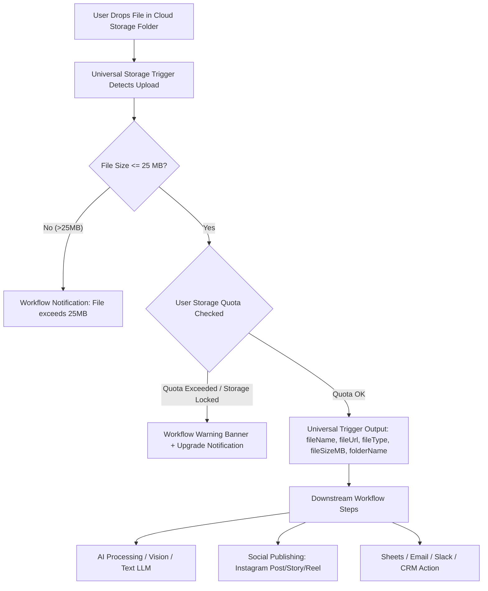

# Feature Specification: Generalized Cloud Storage Automation & Multi-Channel Workflows

## 1. Simple Summary (Executive Overview)
Automatix provides a **Universal Cloud Storage Trigger** that detects new files uploaded to any folder across **Google Drive**, **Microsoft OneDrive**, **Proton Drive**, or **Custom Storage Webhooks**.

Users can chain this generalized trigger with any downstream actions, such as:
- **Instagram Publishing** (Feed Posts, Reels, Stories with multimodal AI captions).
- **Document & Data Processing** (Invoices, PDFs, Spreadsheets, OCR extraction).
- **Media Transcoding & Distribution** (YouTube, TikTok, X/Twitter, Cloud backups).
- **Notifications & Logging** (Email alerts, Slack updates, Google Sheets rows).



---

## 2. Core Functional Requirements & Rules

### 2.1 Universal Cloud Storage Ingestion
* **Flexible Target Folder**:
  * Users can specify **any folder name or path** (e.g., `Automatix Uploads`, `Client Invoices`, `Raw Footage`, `Contracts`, etc.).
  * No folder name is hardcoded or restricted to specific platforms.
* **Storage Providers Supported**:
  * **Google Drive**: Background time-driven Google Apps Script (`setupTrigger()` 1-minute auto-watch).
  * **Microsoft OneDrive**: Power Automate webhook integration.
  * **Proton Drive / Custom**: Direct Webhook Ingestion API with cURL support.
* **File Format Filters**:
  * `ALL` (Images, Videos, Documents, Audio).
  * `IMAGES_ONLY` (.jpg, .png, .webp).
  * `VIDEOS_ONLY` (.mp4, .mov).
  * `DOCUMENTS_ONLY` (.pdf, .doc, .txt, .xlsx, .csv).
* **File Size Guardrail**:
  * **Maximum 25 MB per file** for direct workflow pipeline ingestion.

### 2.2 Standardized Trigger Output Payload
Regardless of the storage provider or folder name, the trigger emits clean, universal variables available to all downstream nodes:
```json
{
  "fileName": "sample_document.pdf",
  "fileUrl": "https://storage.provider.com/direct-file-url",
  "fileType": "application/pdf",
  "fileSizeMB": 4.5,
  "folderName": "Client Invoices",
  "uploadedAt": "2026-08-27T12:00:00.000Z"
}
```

### 2.3 Modular Downstream Action Examples

#### Example 1: Social Media Auto-Publishing (Instagram / Reels / Stories)
1. **Trigger**: Universal Cloud Storage Trigger (`folderName: "Social Media Drops"`).
2. **AI Action**: Multimodal AI Vision (Gemini / GPT-4o / Claude with user's BYOK key) analyzes visual media and writes engaging captions & hashtags.
3. **Instagram Action**: Publishes container as Feed Post, Reel, or Story via Meta Graph API.
4. **Cleanup Action** (Optional): Deletes the file from storage upon confirmed 200 OK publication.

#### Example 2: Document Processing & Notification
1. **Trigger**: Universal Cloud Storage Trigger (`folderName: "Tax Documents"`).
2. **AI Action**: Extracts key figures (invoice total, date, vendor name).
3. **Google Sheets Action**: Appends a row with extracted data.
4. **Email / Slack Action**: Notifies team of newly processed document.

---

## 3. Modular Architecture Principles

* **100% Generalized & Decoupled**: Triggers do not assume downstream destinations. The storage trigger simply captures file metadata and download URLs.
* **Custom Folder Routing**: Users can create multiple storage triggers in different workflows, each watching distinct folders for different business tasks.
* **Safe Error Handling**: If any downstream step fails (AI rate limit, invalid Instagram aspect ratio, SMTP error), the file is never deleted and the workflow log records actionable error details for 1-click retry.

---

## 4. AI Token Consumption & Universal Credit System Architecture (GHL Style)

### 4.1 Role of Automatix in AI Execution
Automatix does **not** replace the underlying foundational AI models (Google Gemini, OpenAI GPT-4o, Anthropic Claude, etc.). Instead, Automatix operates as an **Intelligent Inspector, Synthesizer, Sanitizer, and Workflow Mediator**:
1. **Server-Side Inspection**: Inspects uploaded media assets (resolution, aspect ratio, duration, format integrity, direct CDN streaming).
2. **Context Synthesis**: Transforms media characteristics and campaign parameters into high-signal, token-efficient prompt structures.
3. **AUTOMATIX INSPECTOR**: Silently sanitizes user custom prompts, prevents prompt injection, collapses bloat, and enforces length guards (1,200 chars).
4. **Structured Mediation**: Dispatches the prepared payload to the user's selected AI provider and parses the response into clean, ready-to-publish variables (`{{steps.ai_step.caption}}`, `{{steps.ai_step.title}}`, `{{steps.ai_step.hashtags}}`).

---

### 4.2 Testing vs. Live Workflow Execution Lifecycle

| Execution Mode | Token / Quota Source | Billing / Credit Impact | Behavior |
| :--- | :--- | :--- | :--- |
| **Node Test / Preview Generator** | **User's AI Provider API** | Provider's token quota (e.g. Google AI Studio / OpenAI free or paid tier) | Free on Automatix; consumes provider API tokens directly. |
| **Live Production Workflow** | **Automatix AI Credit Pool** | **1 Automatix AI Credit** deducted per execution step | Gated to Pro/Enterprise plans. Deducts from user's monthly credit allotment or purchased add-on balance. |

---

### 4.3 Universal AI Credit Model (GHL Style)
Similar to GoHighLevel (LC-AI Credits) and enterprise automation platforms, Automatix implements a **single, unified AI Credit Pool** that applies across **all current and future AI steps**:

* **Supported Current & Future AI Nodes**:
  * `ai_mediator` (AI Content Synthesizer & Social Copywriter) — *1 credit / run*
  * `ai_vision_inspector` (Visual OCR, Receipt & Document Extractor) — *1 credit / run*
  * `ai_audio_transcriber` (Voice Note & Video Audio Transcriber) — *1-2 credits / run*
  * `ai_lead_scorer` (CRM Inbound Lead Quality & Sentiment Analysis) — *1 credit / run*
  * `ai_email_writer` (Personalized Dynamic Email Draft Generator) — *1 credit / run*

#### Tiering & Add-on Packages:
1. **Free Tier**:
   - Access to AI Node Test & Sandbox Preview generator (using their own BYOK key).
   - Live workflow execution of AI steps is locked (prompts 1-click Pro upgrade).
2. **Pro / Agency Tier (Included Monthly Allotment)**:
   - Includes **500 to 2,000 AI Credits / month** renewed on billing cycle.
3. **AI Credit Add-On Packs (Self-Serve Add-On Store)**:
   - When a user's monthly allotment is consumed, workflows do not halt if auto-recharge is enabled, or users can buy credit packs on demand:
     - **Starter Pack**: 1,000 AI Credits ($10)
     - **Growth Pack**: 5,000 AI Credits ($40)
     - **Scale Pack**: 15,000 AI Credits ($100)
   - Add-on credits never expire and roll over indefinitely.

